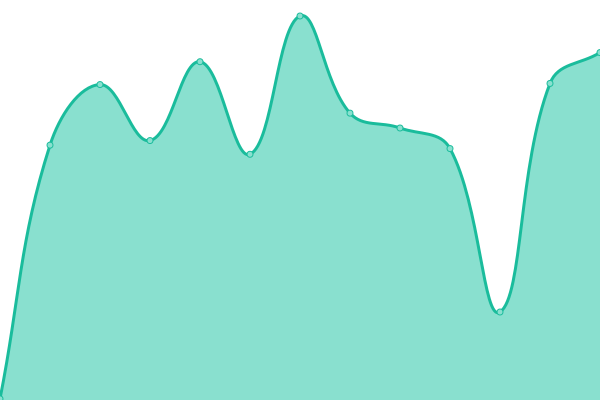
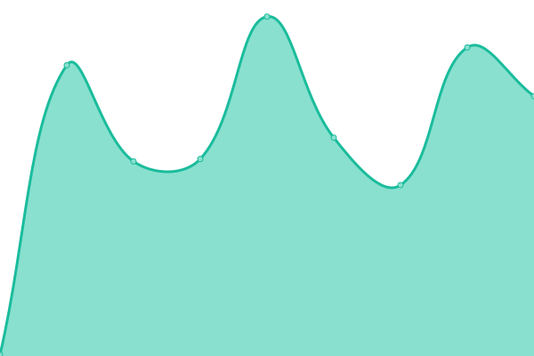
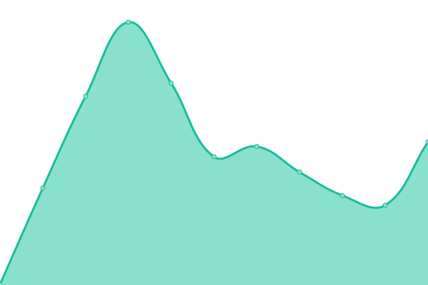
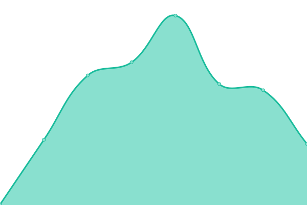
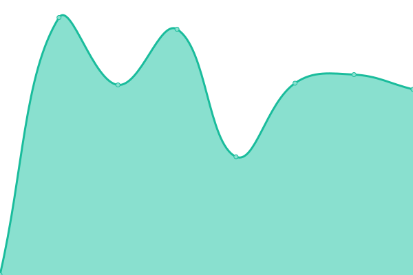
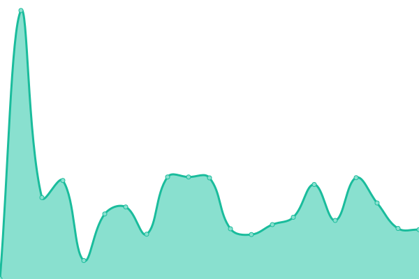
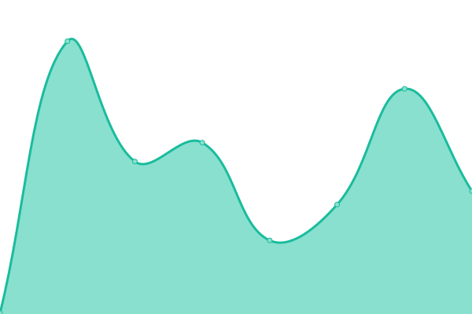

# [📈 Live Status](https://status.dandiarchive.org): <!--live status--> **🟧 Partial outage**

This repository contains the open-source uptime monitor and status page for [DANDI](https://dandiarchive.org) resources, powered by [Upptime](https://github.com/upptime/upptime).

With [Upptime](https://upptime.js.org), you can get your own unlimited and free uptime monitor and status page, powered entirely by a GitHub repository. We use [Issues](https://github.com/dandi/upptime/issues) as incident reports, [Actions](https://github.com/dandi/upptime/actions) as uptime monitors, and [Pages](https://status.dandiarchive.org) for the status page.

<!--start: status pages-->
<!-- This summary is generated by Upptime (https://github.com/upptime/upptime) -->
<!-- Do not edit this manually, your changes will be overwritten -->
<!-- prettier-ignore -->
| URL | Status | History | Response Time | Uptime |
| --- | ------ | ------- | ------------- | ------ |
|  [API (catch all)](https://api.dandiarchive.org/) | 🟩 Up | [api-catch-all.yml](https://github.com/dandi/upptime/commits/HEAD/history/api-catch-all.yml) | 

 310ms
     
 | 

<a href="https://status.dandiarchive.org/history/api-catch-all">100.00%</a>
    

|  [API (Swagger)](https://api.dandiarchive.org/swagger/) | 🟩 Up | [api-swagger.yml](https://github.com/dandi/upptime/commits/HEAD/history/api-swagger.yml) | 

 94ms
     
 | 

<a href="https://status.dandiarchive.org/history/api-swagger">100.00%</a>
    

|  [API Staging (Swagger)](https://api-staging.dandiarchive.org/swagger/) | 🟩 Up | [api-staging-swagger.yml](https://github.com/dandi/upptime/commits/HEAD/history/api-staging-swagger.yml) | 

 362ms
     
 | 

<a href="https://status.dandiarchive.org/history/api-staging-swagger">100.00%</a>
    

|  [Data portal](https://dandiarchive.org/) | 🟩 Up | [data-portal.yml](https://github.com/dandi/upptime/commits/HEAD/history/data-portal.yml) | 

 266ms
     
 | 

<a href="https://status.dandiarchive.org/history/data-portal">99.80%</a>
    

|  [Data portal (000026 DLP)](https://dandiarchive.org/dandiset/000026) | 🟩 Up | [data-portal-000026-dlp.yml](https://github.com/dandi/upptime/commits/HEAD/history/data-portal-000026-dlp.yml) | 

 23ms
     
 | 

<a href="https://status.dandiarchive.org/history/data-portal-000026-dlp">100.00%</a>
    

|  [Data portal (000026 draft file browsing)](https://dandiarchive.org/dandiset/000026/draft/files) | 🟩 Up | [data-portal-000026-draft-file-browsing.yml](https://github.com/dandi/upptime/commits/HEAD/history/data-portal-000026-draft-file-browsing.yml) | 

 45ms
     
 | 

<a href="https://status.dandiarchive.org/history/data-portal-000026-draft-file-browsing">100.00%</a>
    

|  [Data portal Staging](https://gui-staging.dandiarchive.org/) | 🟩 Up | [data-portal-staging.yml](https://github.com/dandi/upptime/commits/HEAD/history/data-portal-staging.yml) | 

 324ms
     
 | 

<a href="https://status.dandiarchive.org/history/data-portal-staging">100.00%</a>
    

|  [ETelemetry server](https://etelemetry.dandiarchive.org/) | 🟥 Down | [e-telemetry-server.yml](https://github.com/dandi/upptime/commits/HEAD/history/e-telemetry-server.yml) | 

 0ms
     
 | 

<a href="https://status.dandiarchive.org/history/e-telemetry-server">17.09%</a>
    

|  [GitHub organization](https://github.com/dandi) | 🟩 Up | [git-hub-organization.yml](https://github.com/dandi/upptime/commits/HEAD/history/git-hub-organization.yml) | 

 1726ms
     
 | 

<a href="https://status.dandiarchive.org/history/git-hub-organization">99.90%</a>
    

|  [Hub](https://hub.dandiarchive.org) | 🟩 Up | [hub.yml](https://github.com/dandi/upptime/commits/HEAD/history/hub.yml) | 

 344ms
     
 | 

<a href="https://status.dandiarchive.org/history/hub">100.00%</a>
    

|  [Neurosift](https://neurosift.app/) | 🟩 Up | [neurosift.yml](https://github.com/dandi/upptime/commits/HEAD/history/neurosift.yml) | 

 153ms
     
 | 

<a href="https://status.dandiarchive.org/history/neurosift">100.00%</a>
    

|  [Ontobee](https://ontobee.org/) | 🟩 Up | [ontobee.yml](https://github.com/dandi/upptime/commits/HEAD/history/ontobee.yml) | 

 927ms
     
 | 

<a href="https://status.dandiarchive.org/history/ontobee">82.25%</a>
    

|  [PURL redirect example1 (ontobee)](http://purl.obolibrary.org/obo/PATO_0000384) | 🟩 Up | [purl-redirect-example1-ontobee.yml](https://github.com/dandi/upptime/commits/HEAD/history/purl-redirect-example1-ontobee.yml) | 

 1222ms
     
 | 

<a href="https://status.dandiarchive.org/history/purl-redirect-example1-ontobee">82.30%</a>
    

|  [identifiers.org redirect example1](https://identifiers.org/DANDI:000027) | 🟩 Up | [identifiers-org-redirect-example1.yml](https://github.com/dandi/upptime/commits/HEAD/history/identifiers-org-redirect-example1.yml) | 

 497ms
     
 | 

<a href="https://status.dandiarchive.org/history/identifiers-org-redirect-example1">100.00%</a>
    

|  [Registry of DataLad (dandisets query)](https://registry.datalad.org/overview/?query=url%3A%22github.com%2Fdandisets%22) | 🟩 Up | [registry-of-data-lad-dandisets-query.yml](https://github.com/dandi/upptime/commits/HEAD/history/registry-of-data-lad-dandisets-query.yml) | 

 680ms
     
 | 

<a href="https://status.dandiarchive.org/history/registry-of-data-lad-dandisets-query">99.22%</a>
    

|  [WebDAV](https://webdav.dandiarchive.org) | 🟩 Up | [web-dav.yml](https://github.com/dandi/upptime/commits/HEAD/history/web-dav.yml) | 

 331ms
     
 | 

<a href="https://status.dandiarchive.org/history/web-dav">100.00%</a>
    

|  [About](https://about.dandiarchive.org/) | 🟩 Up | [about.yml](https://github.com/dandi/upptime/commits/HEAD/history/about.yml) | 

 215ms
     
 | 

<a href="https://status.dandiarchive.org/history/about">100.00%</a>
    

|  [Docs](https://docs.dandiarchive.org/) | 🟩 Up | [docs.yml](https://github.com/dandi/upptime/commits/HEAD/history/docs.yml) | 

 235ms
     
 | 

<a href="https://status.dandiarchive.org/history/docs">100.00%</a>
    

<!--end: status pages-->

[**Visit our status website →**](https://status.dandiarchive.org)

## 📄 License

- Powered by: [Upptime](https://github.com/upptime/upptime)
- Code: [MIT](./LICENSE) © [Anand Chowdhary](https://anandchowdhary.com), supported by [Pabio](https://pabio.com)
- Data in the `./history` directory: [Open Database License](https://opendatacommons.org/licenses/odbl/1-0/)
